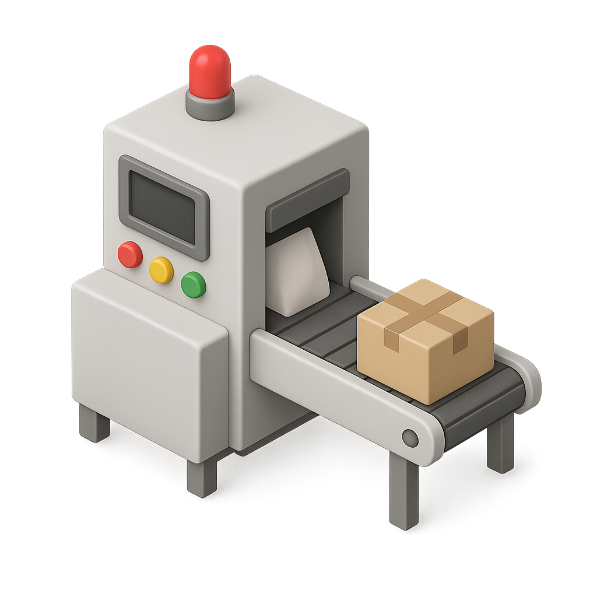

R packages
===
Column {.tabset}
-----------------------------------------

### What is a package?
<div style="max-width: 70%;">

<div class="row-content">
#### What's a package in general?
An R package is a structured collection of R functions, documentation, and sometimes data sets, bundled together to make code reusable and shareable. Instead of copying and pasting functions between scripts, packages allow you to organize your work in one place, keep it version-controlled, and easily share it with others. 

Using packages ensures consistency, efficiency, and reproducibility—whether you are working on your own or collaborating in a team.
</div>

<div class="row-content">
#### Why this package?
Our methodology consists of different steps:

1. Create the scenarios file by sampling input parameters from probability distributions
2. Virtually "perform" these scenarios, creating a set of activated items
3. Gather items in packages 
4. Extract scaling factors or transfer functions so that we can use them to characterize said packages
5. Perform virtual gamma-spec measurements and apply above scaling factors/transfer functions to get the qualities we need for characterization (eg. IRAS, Co-60 equivalent)

These steps are the same no matter the elimination campaign we're working on. And each step can be accompanied by some standard visualizations that also don't change no matter the campaign. In order to avoid having to code the same thing to plot the same figure all the time, we can gather all the functions needed in a package that we will load and it will produce all the plots.

<div style="text-align: center;">
  
</div>

</div>
</div>


### How to develop?


<div class="row-content">
#### Structure
An R package is essentially a folder with a specific structure that R understands. The main components are:

- **R/** : This folder contains all your function scripts.

- **DESCRIPTION** : A file with metadata about the package (name, version, author, dependencies).

- **NAMESPACE** : A file that tells R which functions to export and which packages you depend on (this is usually handled automatically by roxygen2).

- **man/** : Documentation files for each function (auto-generated).
</div>

<div style="display: flex; gap: 20px; align-items: flex-start;">

<div style="flex: 3; min-width: 0;">

<div class="row-content">
#### How to build

1. Install the necessary tools:

```
install.packages("devtools")
install.packages("roxygen2")
```

2. Create a new package

```
devtools::create("myPackage")
```

3. Add your .R scripts into R/

4. Document by using roxygen comments above the functions

```
#' Title of the function
#' @param x Description of parameter x
#' @return What the function returns
my_function <- function(x) {
  x + 1
}
```

5. Run the documentation

```
devtools::document()
```

6. Run the installation

```
devtools::install()
```

</div>
</div>


<div style="flex: 2; min-width: 0;">
<div style="text-align: center;">
  
</div>

</div>
</div>


### How to share?
<div style="max-width: 70%;">

You can store your package on github or gitlab and install wherever with

```
install_github("elissw/RVizPackage")
```

<div style="text-align: center;">
  
</div>

</div>

Visualisation best practices
===
Column {.tabset}
-----------------------------------------

### Data visualisation
<div style="max-width: 70%;">

<div class="row-content">
#### What is it?
</div>


</div>


Mowiz output files
===
Column {.tabset}
-----------------------------------------

### Scenarios (scn)

### Items (itm)

### Packages (pck)

### Scaling factors (fct)

### Measurements (msr)


The Viz package
===
Column {.tabset}
-----------------------------------------


